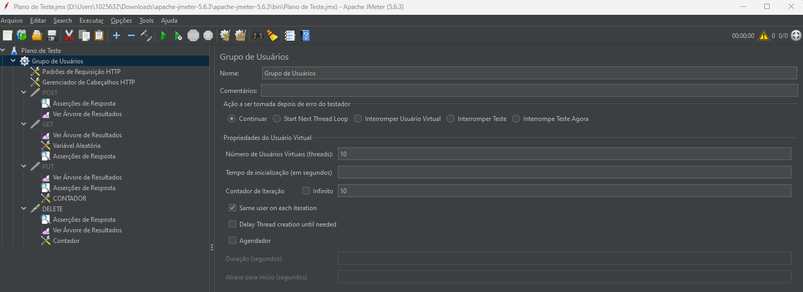
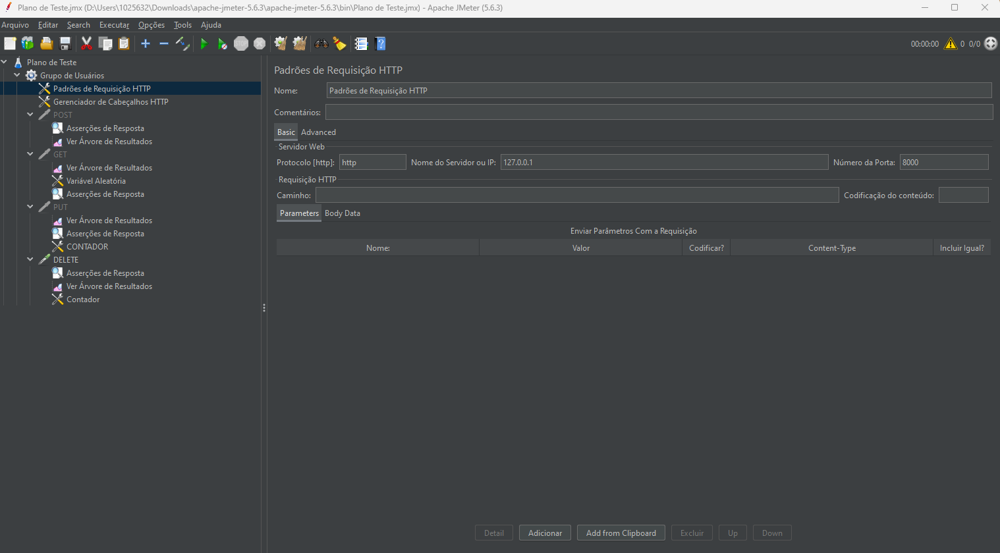
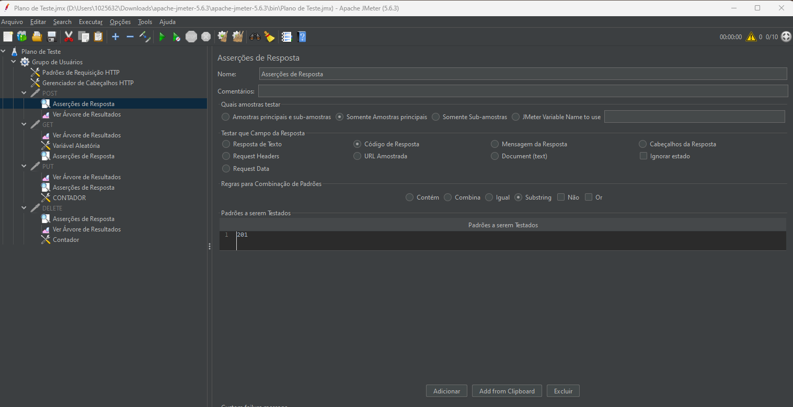
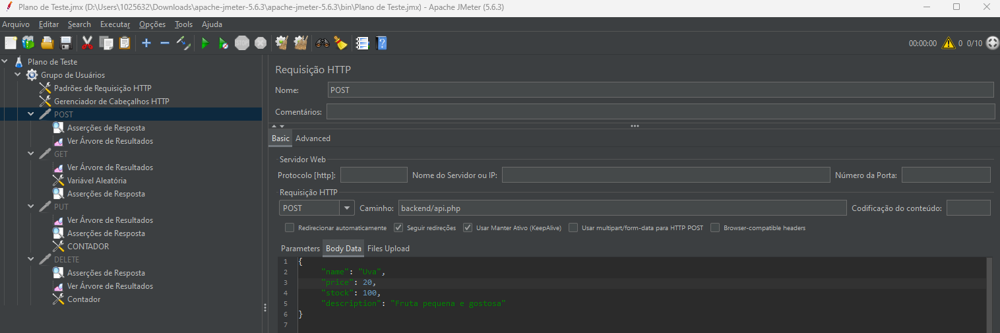
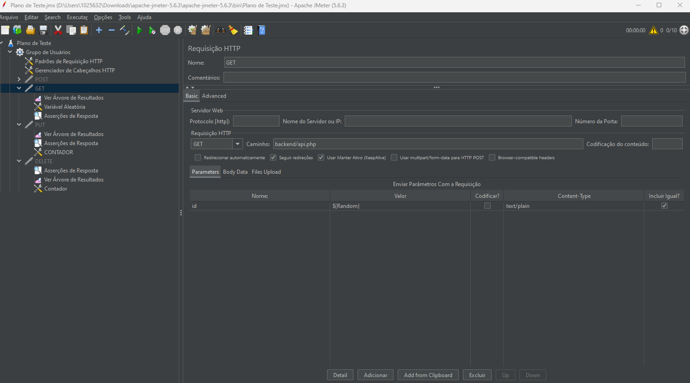
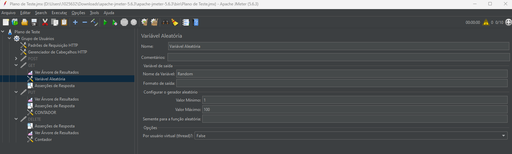
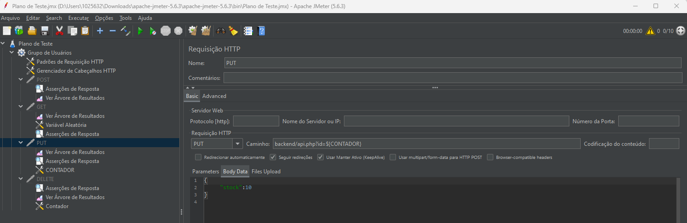
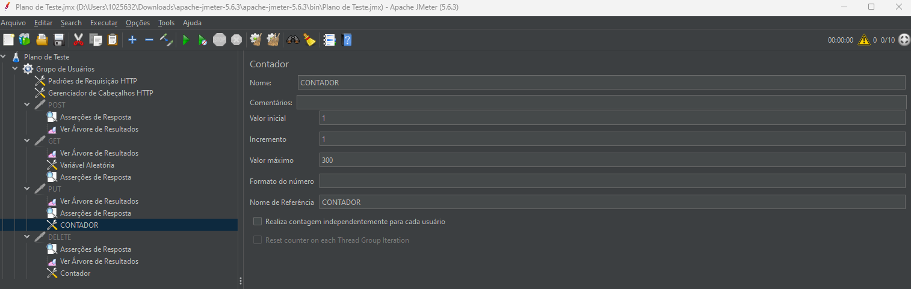
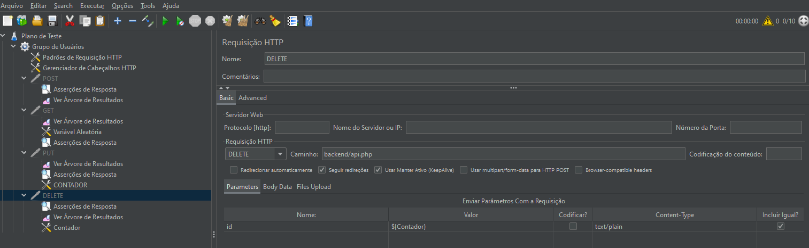

# Teste de Carga 
Hoje eu aprendi a utilizar JMeter para teste de carga em um servidor PHP.
O servidor PHP está rodando dentro de uma VM utilizando Ubuntu. Abri as portas da VM para que o Windowns pudesse conectar com o servidor PHP para que os testes pudessem realizados.  
- - -
### Explicando a função do Grupo de Usuario

O Grupo de Usuários controla exatamente como essa carga de usuários virtuais será executada. As três configurações mais importantes são:

1. Número de Threads (Usuários Virtuais)
Para que serve: Define a quantidade de usuários independentes que o JMeter irá simular.
    Exemplo: Se você definir 100 threads, o JMeter simulará 100 pessoas acessando seu sistema simultaneamente.
2. Período de Ramp-up (em segundos)
Para que serve: Define o tempo que o JMeter levará para iniciar todos os usuários virtuais. É a forma de aumentar a carga gradualmente.
    Exemplo: Se você tem 100 threads e um Ramp-up de 10 segundos, o JMeter iniciará 10 usuários por segundo (100 threads / 10 segundos). Isso simula um aumento de tráfego mais realista do que iniciar todos os 100 de uma vez.
3. Contagem de Loops (Iterações)
Para que serve: Define quantas vezes cada usuário virtual irá repetir o cenário de teste (conjunto de requisições) definido no Grupo de Usuários.
    Exemplo: Se você tem um loop de contagem de 5, cada um dos seus usuários virtuais executará o login, a busca e a compra (seu cenário) 5 vezes.

- - -
### Explicando a função do Padrões de Requisição HTTP

O HTTP Request Defaults (Padrões de Requisições HTTP) serve para definir um conjunto de valores base que serão aplicados automaticamente a todos os Samplers HTTP Requests que estiverem dentro do seu escopo (geralmente, dentro do mesmo Thread Group ou no Plano de Teste inteiro). Seu objetivo principal é a reutilização de código e a manutenção simplificada.

#### Configurações essenciais do Padrões de Requisição HTTP

Ao configurações do Sampler HTTP Request:

- Protocolo: http ou https.
- Server Name or IP: O domínio ou IP do servidor (ex: api.meuprojeto.com.br).
- HTTP Request: Selecione o método (GET, POST, PUT, etc.).
- Path: O caminho específico do recurso (ex: /api/usuarios, /produtos/123).
- Body Data/Parameters: Para requisições POST, PUT ou PATCH, é onde você coloca os dados a serem enviados (geralmente JSON ou XML). 

- - -

### Explicando a função do Gerenciador de Cabeçalhos HTTP

O Gerenciador de Cabeçalhos HTTP (HTTP Header Manager) é um Elemento de Configuração essencial, cuja função principal é garantir que suas requisições HTTP (como GET, POST, etc.) se pareçam exatamente com as que um navegador ou cliente de API enviaria. Em essência, ele permite que você adicione, modifique ou substitua os cabeçalhos que acompanham cada requisição.

#### Por que o Gerenciador de Cabeçalhos é Necessário ?

Simular Navegadores Reais

Você usa o Header Manager para enviar cabeçalhos comuns que identificam o cliente, como:

- User-Agent: Indica qual navegador (Chrome, Firefox, etc.) ou dispositivo está fazendo a requisição. Muitos servidores e sistemas de segurança usam isso para rastreamento ou validação.

- Accept-Language: Define o idioma preferido do usuário (ex: pt-BR,pt;q=0.9).

Testar APIs (Requisições REST)

Esta é a função mais crucial em testes de API:

- Content-Type: Informa ao servidor o formato dos dados que você está enviando no corpo da requisição (Body Data).

- Exemplo: Para APIs REST, você define Content-Type: application/json para um POST ou PUT.

- Authorization: Essencial para segurança. É aqui que você envia tokens de autenticação (como Bearer tokens JWT ou chaves de API) para provar que o usuário virtual está logado e tem permissão.

- Accept: Informa ao servidor o formato de dados esperado na resposta (geralmente também application/json ou application/xml).

- - -

### Explicando a função da Árvore de Resultados

A Árvore de Resultados é um Listener (Ouvinte) é fundamental.

- Função Principal: Serve como uma ferramenta de depuração e visualização imediata dos resultados de cada requisição individual.

Ao contrário de outros Listeners que focam em métricas agregadas (médias, throughput), a Árvore de Resultados permite que você veja:

1. A Requisição (Request): Os dados exatos que o JMeter enviou ao servidor (cabeçalhos, parâmetros, corpo da requisição).

2. A Resposta (Response): Os dados que o servidor devolveu, incluindo o código de status HTTP (200, 404, 500, etc.) e o corpo da resposta (HTML, JSON, XML).

3. Dados do Sampler: Métricas detalhadas daquela requisição (tempo de resposta, latência, tamanho dos dados).

Uso Ideal: É indispensável durante a criação e depuração do seu script para garantir que o JMeter está enviando as requisições corretas e recebendo as respostas esperadas. Deve ser desativado durante a execução de testes de carga de grande volume, pois consome muitos recursos da máquina.

- - -

### Explicando a função das Asserções de Respostas

As Asserções de Respostas são elementos cruciais para a validação do teste, indo além de apenas verificar se o servidor respondeu (código 200).

- Função Principal: Permitem que você verifique se o conteúdo da resposta (código, corpo, cabeçalhos) atende a critérios específicos.

Uma asserção é um "teste" dentro do seu teste de performance. Ela transforma uma requisição tecnicamente bem-sucedida (status 200) em uma falha se o conteúdo estiver incorreto.

- Exemplos de Uso:

    - Verificar se o código de status é 200 (OK) ou 201 (Created).

    - Garantir que o corpo da resposta contenha o texto "Bem-vindo, João" ou um ID de sessão válido.

    - Checar se o tempo de resposta é inferior a 500ms (usando a Duration Assertion).

Uso Ideal: Devem ser adicionadas a cada requisição importante para garantir a integridade dos dados e simular um teste funcional antes de aplicar carga.

- - -

### Explicando a função da Requisição HTTP POST

Função Principal: Simular o envio de dados para o servidor com o objetivo de criar um novo recurso ou executar uma ação que altere o estado do sistema.

Uso no Teste de Carga:

- Criação: Cadastrar um novo produto.

No JMeter, você define o corpo da requisição (Body Data) que contém os dados (geralmente JSON ou XML) que serão enviados ao servidor.

- - -

### Explicando a função da Requisição HTTP GET

Função Principal: Simular a solicitação e recuperação de dados de um recurso específico no servidor. É o padrão de requisição mais comum para navegação.

Uso no Teste de Carga:

- Consulta: Fazer uma busca no catálogo.

O método GET não deve alterar o estado do servidor e, idealmente, não deve ter corpo de requisição, passando dados apenas pela URL (como parâmetros de query).

- - -

### Explicando a função da Variavel Aleatória

A Variável Aleatória é um Elemento de Configuração muito útil para a parametrização do teste.

Função Principal: Gera um valor único e aleatório dentro de um intervalo definido a cada iteração de um usuário virtual.

Uso Ideal:

- Dados de Teste: Criar nomes de usuário, senhas ou strings de busca aleatórias, garantindo que cada usuário virtual (thread) use dados diferentes em suas requisições, evitando problemas de cache no servidor.

Evitar Colisão: Garantir que dois usuários não tentem usar o mesmo ID ou nome ao mesmo tempo, o que pode ocorrer em cenários de criação de recursos (POST).

- - -

### Explicando a função da Requisição HTTP PUT

Função Principal: Simular a substituição completa de um recurso existente no servidor com os novos dados fornecidos.

Uso no Teste de Carga:

- Atualização Completa: Alterar todos os dados de um perfil de usuário, enviando a representação completa do novo recurso. Se algum campo for omitido, ele será geralmente apagado (comportamento de substituição).

- - -

### Explicando a variavel Contador

O Contador é um Elemento de Configuração usado para gerar uma sequência numérica crescente para ser utilizada em seu script.

- Função Principal: Cria uma variável que armazena um valor inteiro que é incrementado a cada vez que o elemento é executado.

Configurações Chave:

- Start: O número onde a contagem deve começar (ex: 1).

- Increment: O valor a ser adicionado a cada loop (ex: 1).

- Maximum: O valor máximo a ser atingido.

- Track Counter Independently for Each User: Define se o contador é global (compartilhado por todos os usuários) ou local (cada usuário tem sua própria contagem).

Uso Ideal:

- IDs Únicos: Criar um ID sequencial para um recurso em requisições POST ou PUT (ex: user${__counter(TRUE,)}).

- Controle de Loops: Usar o valor para limitar o número de iterações em um controlador lógico ou para acessar linhas específicas em um arquivo CSV.

- - -

### Explicando a função da Requisição HTTP DELETE

Função Principal: Simular a remoção de um recurso específico no servidor.

Uso no Teste de Carga:

- Limpeza de Dados: Excluir um item do carrinho, remover um produto ou deletar uma conta de usuário criada durante o teste.

